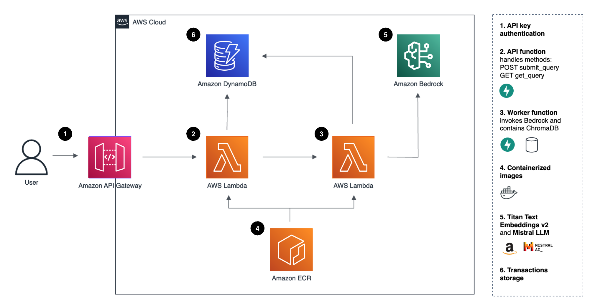

# Deploying a Serverless RAG-Based Knowledge Assistant on AWS

This project demonstrates a **scalable, serverless** Retrieval-Augmented Generation (RAG) application, deployed on AWS using **AWS CDK** for infrastructure as Code. The system enables querying internal knowledge bases with **FastAPI, Amazon Bedrock (Mistral for LLM, Titan v2 for embeddings), DynamoDB, Lambda, API Gateway** for efficient and cost-effective knowledge retrieval.

The data sources used for example purpose are ISO 27001 standard, NIS2 regulation and the Information Security & Cyber Resilience Policy of ACME Industrial Solutions (fictitious company), but the framework can be applied to any foundational knowledge (image/src/data/source).

- **Asynchronous Query Processing** – A worker Lambda function enables submitting queries and retrieving responses later, improving scalability.
- **Multi-stage API Deployment** – API Gateway authentication via API key enables controlled access.
- **Fully Serverless Architecture** – Runs without the need for infrastructure management, leveraging AWS’s pay-per-use model.
- **CDK-Managed Deployment** – Infrastructure-as-Code (IaC) ensures repeatability, version control, and easy scaling.
- **Optimized Query Storage** – DynamoDB stores queries and results for efficient retrieval.
- **Mangum wrapper** – Enables FastAPI to run seamlessly in an AWS Lambda environment.
- **IAM policies and logging** - Provide security, usage tracking, and cost visibility.



---

## Getting Started

### 1. AWS Configuration

Ensure you have:

An **AWS account** and **AWS CLI** installed.  
AWS CDK **bootstrapped** (`cdk bootstrap`).  
**Amazon Bedrock access** enabled in your region.  

### 2. Set Up Environment Variables

Create a `.env` file inside the `image/` directory (excluded from Git). Example:

```ini
AWS_ACCESS_KEY_ID=XXXXX
AWS_SECRET_ACCESS_KEY=XXXXX
AWS_DEFAULT_REGION=eu-west-1
TABLE_NAME=YourDynamoDBTable
```

This is required for local testing and AWS authentication.

---

## Local Development & Testing

### 1. Install Requirements

```bash
pip install -r image/requirements.txt
```

### 2. Build Vector Database

Place PDF documents in `image/src/data/source/`, then run:

```bash
python image/populate_database.py --reset
```

### 3. Run Locally (Without Docker)

```bash
cd image/src
python app_api_handler.py
```

API available at: [http://0.0.0.0:8000/docs](http://0.0.0.0:8000/docs)

### 4. Test Locally

```bash
curl -X 'POST' \
  'http://0.0.0.0:8000/submit_query' \
  -H 'accept: application/json' \
  -H 'Content-Type: application/json' \
  -d '{
  "query_text": "How does the ACME policy comply with access management security?"
}'
```

---

## Using Docker Image

### 1. Build and Test the Image Locally

```bash
docker build --platform linux/amd64 --provenance=false -t aws_rag_app .
```

**Run the container (worker function test):**

```bash
docker run --rm -it \
    --entrypoint python \
    --env-file .env \
    aws_rag_app app_work_handler.py
```

### 2. Serve API Locally via Docker

```bash
docker run --rm -p 8000:8000 \
    --entrypoint python \
    --env-file .env \
    aws_rag_app app_api_handler.py
```

API available at: [http://0.0.0.0:8000/docs](http://0.0.0.0:8000/docs)

---

## Deploy to AWS

### 1. Install CDK Dependencies

```bash
cd rag-cdk-infra/
npm install
```

### 2. Deploy to AWS

```bash
cdk deploy
```

Once deployed, **API Gateway URL** will be printed.

### 3. Test Deployed API

Use Postman or `curl`:

```bash
curl -X 'POST' \
  '<your-api-gateway-url>/submit_query' \
  -H 'x-api-key: YOUR_API_KEY' \
  -H 'accept: application/json' \
  -H 'Content-Type: application/json' \
  -d '{
  "query_text": "How does the ACME policy comply with access management security?"
}'
```

---

## Next Steps & Enhancements

While this architecture is **lightweight and scalable**, future improvements can include:

**Multi-tenancy support** – Secure access for multiple clients.  
**Advanced RAG techniques** – Enhanced prompt engineering, agent-based responses.  
**Custom embeddings** – Optimized retrieval for domain-specific applications.  
**Accuracy, latency, and cost optimizations** – Performance tuning across inference and storage.  

---

## Acknowledgments

This project builds on the original work of **Pixegami** (full repo here: https://github.com/pixegami/deploy-rag-to-aws), whose foundational design and guidelines made this possible.

